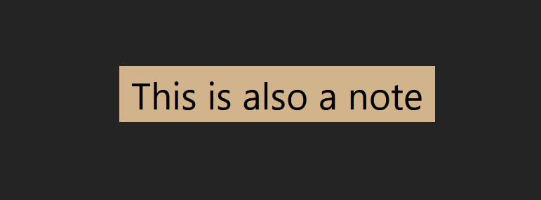

# What is react?

React is a framework for making applications using components.

---

# What does it do?

- React Dom (web)
- React Native
  - Android/IOS (mobile)
  - Windows/Mac (desktop)

---

# Advantages of React

- Lets you create applications with components
- Lets you bundle style, layout, and state into components
- Is a reactive framework
  - Components automatically re-render when their state changes
  - For most use cases users don't need to manually bind state

---

# Components

A component is a primitive that takes some state, and renders it to a view.


---

# Components

Source Code

```tsx
return (<Note text="This is a note" />)
```


---

# Components

Source Code

```tsx
return (<Note text="This is also a note" />)
```



---

# Components

```tsx
const [count, setCount] = useState(0);

return (
  <>
    <Note text={`Count ${count}`} />
    <button onClick={() => setCount(count + 1)}>Increase</button>
  </>
);
```

---

# Components


---

# Show demo

---

# Function Components


---

# Function Components

```tsx
export interface NoteProps {
  text: string;
}

export function Note(props: NoteProps) {
  return (
    <div className="note">
      <p>{props.text}</p>
    </div>
  );
}

```

---

# Function Components

```tsx
function App() {
  const [count, setCount] = useState(0);

  function handleButton(){
    setCount(count + 1);
  }

  return (
    <>
      <Note text={`Count ${count}`} />
      <button onClick={handleButton}>
        Increase
      </button>
    </>
  );
}
```

---

# Hooks

- Hooks are special functions that automatically update your component when they change.
- React has some useful built in hooks such as `useState`, `useRef` and `useContext`
- Today we're going to cover `useState` and `useContext`

---

# Hooks

The use state hook lets you add state to your components.

```tsx
// This is the type of the use state hook.
// T is a generic parameter that can be any type.
function useState<T>(initialValue?: T): [value: T, setValue: (value: T) => void];
```

---

# Hooks

Components can use hooks to manage their state

```tsx
// This will create a variable called value
// It's type is number
// It's initial value is 0
const [value, setValue] = useState<number>(0);
```

---

# Hooks

```tsx
// This will create a string value
// It's initial value will be undefined.
const [myString, setMyString] = useState<string>();
```

---

# Hooks

```tsx
interface Character{
  // The question mark makes this field optional
  name?: string;
  level?: number;
}

// This will create a character.
// Initially, the characters name and level will be undefined.
const [myCharacter, setMyCharacter] = useState<Character>({});
```

---

# Hooks

```tsx
function MyCharacterNameInput(){
  const [myCharacter, setMyCharacter] = useState<Character>({});

  return (
    <input
      value={myCharacter.name}
      // This is using the reducer pattern
      setValue={(e) => setMyCharacter((prev) => ({...prev, name: e.target.value}))}
    />
  )
}
```

---

# Hook Setters

Hooks can be set in two ways

1. Set by value
2. Set by reducers

---

# Hook Setters

Here is an example of setting a hook by value

```tsx
const [myCharacter, setMyCharacter] = useState<Character>();

function handleButton(){
  // level will be set to undefined, because it's not included in the value
  setMyCharacter({name: 'Foo'});
}

return <button onClick={handleButton}/>
```

---

# Hook Setters

- A reducer is a function which takes the original character as an argument
and returns a new character as the output

- When you call the hook you pass in a reducer function to it to change it's value

---

# Hook Setters

```tsx
const [myCharacter, setMyCharacter] = useState<Character>();

function handleButton(){
  // Here we pass a function to setMyCharacter
  // prev is the previous value of the character
  // The ({}) syntax allows us to return an object
  // The ... in javascript is called a spread
  // ...prev takes all of the values and puts them in the results
  // The name: 'Foo' after the prev overrides foo in the output.
  setMyCharacter((prev) => ({...prev, name: 'Foo'}));
}

return <button onClick={handleButton}/>
```

---

# Hook Setters

```tsx
const [myCharacter, setMyCharacter] = useState<Character>();

function handleButton(){
  
  // This is probably a bug.
  // Foo will be overridden with the previous name
  // Unless the previous name was undefined.
  // This is because prev appears after name
  setMyCharacter((prev) => ({name: 'Foo', ...prev}));
}

return <button onClick={handleButton}/>
```

---

# Hook Rules

Hooks have some rules you need to follow to use them.

---

# Hook Rules

## Hooks must only be used inside components.

```tsx
function MyComponent(){

  // Correct
  const [state, setState] = useState('');

  return <button/>
}
```

---

# Hook Rules

```tsx
// Wrong!
const [state, setState] = useState('');

function MyComponent(){


  return <button/>
}
```

---

# Hook Rules

```tsx
function MyComponent(){

  function handleButton(){
    // Wrong!
    const [state, setState] = useState('');
  }


  return <button/>
}
```

---

# Hook Rules

## Hooks must never be called conditionally

```tsx
function MyComponent(){
  const [value, setValue] = useState('');

  if(value === ''){
    // Wrong. 
    // The hook will not work because it's inside an if statement.
    const otherValue = useState(value);
  }
}
```

---

# Hook Rules

```tsx
function MyComponent(){
  for (let i = 0; i < 10; i++){
    // Wrong. Don't use hooks inside a for loop.
    // Instead make child components and use the hooks inside the children.
    const [value, setValue] = useState('');
  }
}
```

---

# Node

React is a framework for javascript/typescript

So we need a development environment

---

# Runtimes

|            | Runtime    | Package Manager |
| ---------- | ---------- | --------------- |
| Python     | python     | pip             |
| Javascript | node       | npm / yarn      |
| Typescript | ts-node    | npm / yarn      |
| Java       | java / jvm | gradle          |
| C#         | dotnet     | nuget           |

---

# Setting up Node

Install node using one of the following

I recommend nvm

- [nvm](https://github.com/nvm-sh/nvm?tab=readme-ov-file#installing-and-updating)
- [nodejs.org](https://nodejs.org/en)

---

# Vite

Vite is a tool for developing react apps

```bash
npm create vite@latest
```

- name your project
- select react
- select typescript

---

# Running vite

```bash
cd project-name
npm install
npm run dev
```

---

# Exercise

---

# Context

- A context is an object that allows you to easily 
  access state in child components.

- You can create a context higher up in the application,
  and then it can be accessed by all your children.

---

# Context

```tsx
// Create the type for the context state
interface MyContextType {
  value: string;
  setValue(value): void;
}

// Create an empty context with mock implementation
const MyContext = createContext<MyContextType>({value: '', setValue(){}});
```

---

# Context

```tsx
// Create a provider for your context
// Anything inside of this provider will have access to the context.

export function MyContextProvider(props: PropsWithChildren){
  const [value, setValue] = useState('');

  return (
    <MyContext.Provider value={setValue}>
      {...props}
    </MyContext.Provider>
  );
}

export function useMyContext(){
  return useContext(MyContext);
}
```

---

# Context

```tsx
// Create a component that will use the context
export function MyContextConsumer(){
  const myContext = useMyContext();

  return <input value={myContext.value} setValue={(e) => myContext.setValue(e.target.value)} />;
}
```

---

# Context

```tsx
// Add your context to App

function App(){
  return (
    <MyContextProvider>
      <MyContextConsumer/>
    </MyContextProvider>  
  );
}
```

---

# Context

```tsx
// This will not do what you expect because there is no provider
function App(){
  return (
    <MyContextConsumer/>
  )
}
```

---

# Context

A context will work no matter how deep the child is in your application.

It is a common pattern to create several global contexts with state
that the rest of your app needs

---

# Context

```tsx
// At the root of your app.
function App(){
  return (
    <ApiProvider>
      <ThemeProvider>
        <CharacterStateProvider>
            <AppRouter/> 
        </CharacterStateProvider>
      </ThemeProvider>
    </ApiProvider>   
  )
}
```

---

# Context

```tsx
// Somewhere else in your app
function MyCharacterEditor(){
  const myCharacter = useCharacterContext();

  return (
    <div className='col'>
      <div className='row'>
        <h4>Character</h4>
        <input 
          value={myCharacter.name} 
          onChange={(e) => myCharacter.setName(e.target.value)} 
        />
      </div>
    </div>
  )
}
```

---

# Exercise